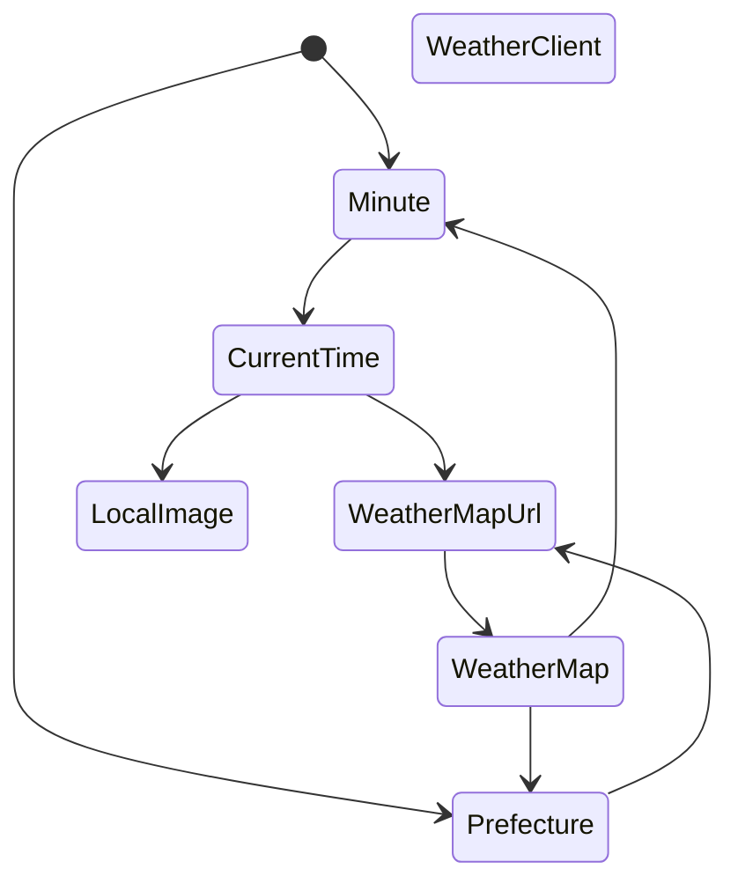
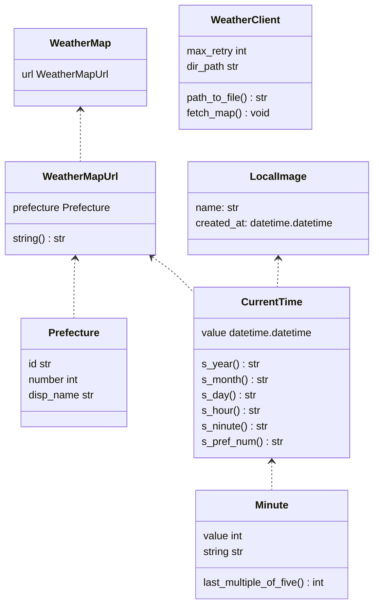

# rain-monitor

```mermaid
stateDiagram-v2
	[*] --> Minute
	[*] --> Prefecture
	Minute --> CurrentTime
	CurrentTime --> WeatherMapUrl
	Prefecture --> WeatherMapUrl
	WeatherMapUrl --> WeatherMap

	CurrentTime --> LocalImage

	WeatherMap --> Prefecture
	WeatherMap --> Minute
	WeatherClient
```

```mermaid
classDiagram
	class Minute {
		value int
		string str
		last_multiple_of_five() int
	}

	class CurrentTime {
		value datetime.datetime
		s_year() str
		s_month() str
		s_day() str
		s_hour() str
		s_ninute() str
		s_pref_num() str
	}
	CurrentTime <.. Minute

	class Prefecture {
		id str
		number int
		disp_name str
	}

	class WeatherMapUrl {
		prefecture Prefecture
		string() str
	}
	WeatherMapUrl <.. Prefecture
	WeatherMapUrl <.. CurrentTime

	class WeatherMap {
		url WeatherMapUrl
	}
	WeatherMap <.. WeatherMapUrl
	class LocalImage {
		name: str
		created_at: datetime.datetime
	}
	LocalImage <.. CurrentTime

	class WeatherClient {
		max_retry int
		dir_path str
		path_to_file() str
		fetch_map() void
	}
```