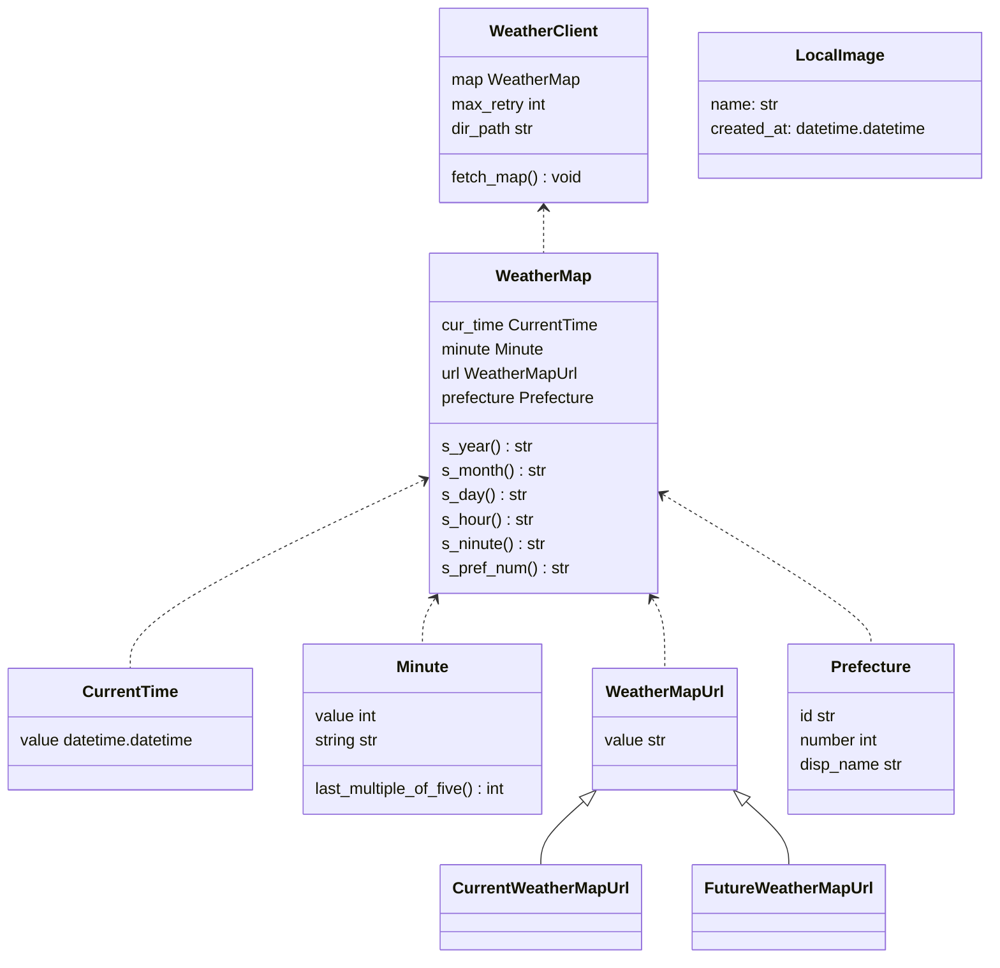

# rain-monitor

```mermaid
classDiagram
	class CurrentTime {
		value datetime.datetime
	}

	class Minute {
		value int
		string str
		last_multiple_of_five() int
	}

	class WeatherMapUrl {
		value str
	}
	class CurrentWeatherMapUrl {
	}
	class FutureWeatherMapUrl {
	}
	WeatherMapUrl <|-- CurrentWeatherMapUrl
	WeatherMapUrl <|-- FutureWeatherMapUrl

	class Prefecture {
		id str
		number int
		disp_name str
	}

	class WeatherMap {
		cur_time CurrentTime
		minute Minute
		url WeatherMapUrl
		prefecture Prefecture
		s_year() str
		s_month() str
		s_day() str
		s_hour() str
		s_ninute() str
		s_pref_num() str
	}
	WeatherMap <..CurrentTime
	WeatherMap <..Minute
	WeatherMap <..WeatherMapUrl
	WeatherMap <..Prefecture

	class WeatherClient {
		map WeatherMap
		max_retry int
		dir_path str
		fetch_map() void
	}
	WeatherClient <..WeatherMap

	class LocalImage {
		name: str
		created_at: datetime.datetime
	}
```