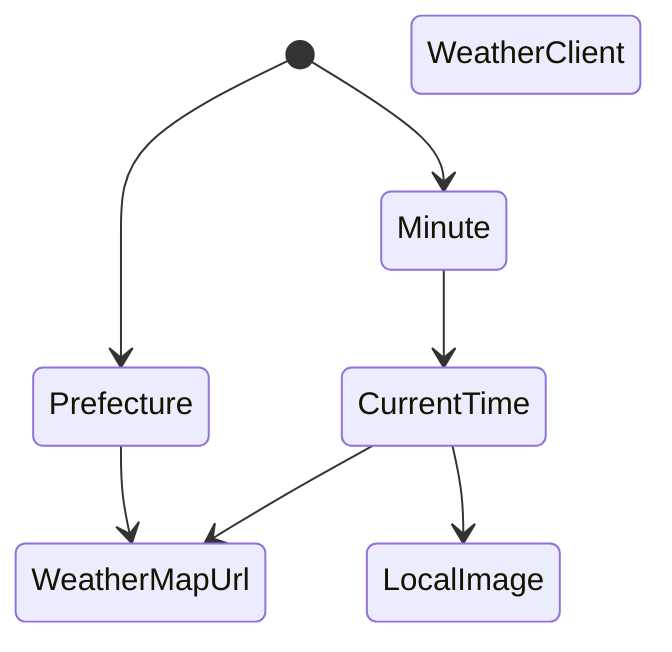
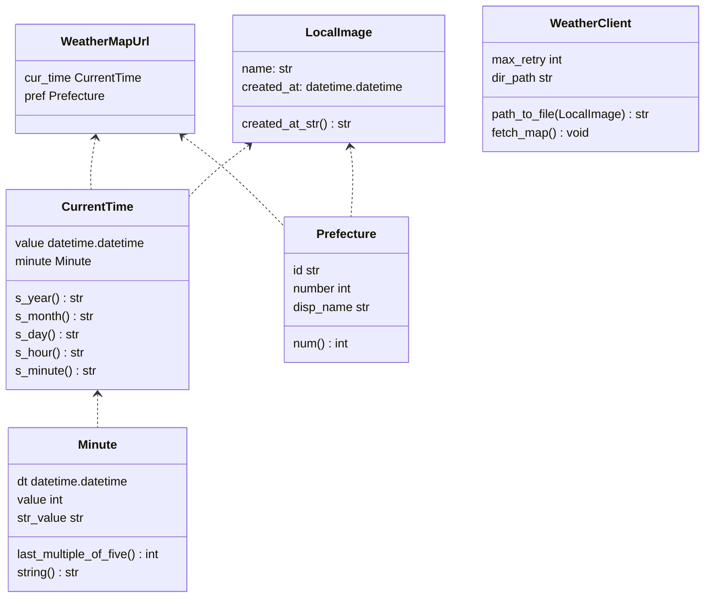

# rain-monitor

```mermaid
stateDiagram-v2
	[*] --> Minute
	[*] --> Prefecture
	Minute --> CurrentTime
	CurrentTime --> WeatherMapUrl
	Prefecture --> WeatherMapUrl

	CurrentTime --> LocalImage

	WeatherClient
```

```mermaid
classDiagram
	class Minute {
		dt datetime.datetime
		value int
		str_value str
		last_multiple_of_five() int
		string() str
	}

	class CurrentTime {
		value datetime.datetime
		minute Minute
		s_year() str
		s_month() str
		s_day() str
		s_hour() str
		s_minute() str
	}
	CurrentTime <.. Minute

	class Prefecture {
		id str
		number int
		disp_name str
		num() int
	}

	class WeatherMapUrl {
		cur_time CurrentTime
		pref Prefecture
	}
	WeatherMapUrl <.. Prefecture
	WeatherMapUrl <.. CurrentTime

	class LocalImage {
		name: str
		created_at: datetime.datetime
		created_at_str() str
	}
	LocalImage <.. CurrentTime
	LocalImage <.. Prefecture

	class WeatherClient {
		max_retry int
		dir_path str
		path_to_file(LocalImage) str
		fetch_map() void
	}
```